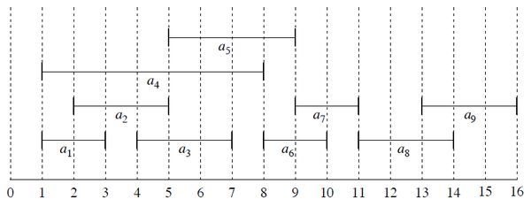
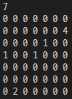
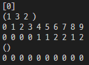
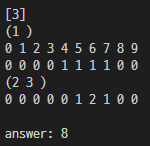

# 2383. [모의 SW 역량테스트] 점심 식사시간
---

##  문제 요약
N x N 사이즈의 map에 사람 M명, 계단이 2개 배치되어 있다.
계단은 L의 길이를 가지며, L만큼의 시간동안 내려간다.
각 계단에는 최대 3명의 사람이 내려가고 있을 수 있으며,
3명이 내려가가고 있을 경우, 3명 미만이 될 때까지 기다렸다가 내려가야 한다.

**입력**
map의 크기 N (4 <= N <= 10)
N x N 형태의 map (1은 사람, 2이상의 숫자는 계단의 입구 및 그 계단의 길이)

**출력**
모든 사람이 이동을 완료하는 최소의 시간

## 기술
#### ~~Greedy~~
1. ~~가까운 사람 먼저 내려간다~~
기다리는 시간이 더 길 수도 있다.

2. ~~이동을 먼저 완료하는 순서대로 정렬~~
 회의실 배정 문제 (greedy의 대표 문제)
어떤 계단을 선택하느냐에 따라 이동을 완료하는 시간이 달라진다.
<br>
#### ~~Dynamic Programming~~
~~DFS를 활용해 어떤 계단을 선택하는지에 따라 ```min(stair0, stair1)```을 채택한다.~~
DP의 경우 앞선 경우가 뒤의 결과에 영향을 미치지 않아야 하는데,
어떤 계단을 선택하느냐에 따라 이후의 결과들도 달라질 수 있다.
<br>
#### DFS (Depth First Search)
(DFS라고 하는게 맞는지는 모르겠지만...)
0번 계단을 선택했을 때와 1번 계단을 선택했을 때 두가지 경우로 나누어 결과가 최소가 되는 값을 찾는다.

#### 완전탐색
DFS를 통해 모든 경우를 탐색하게 된다.
```
0   1   2   ...
0 ─ 0 ┬ 0
    │ └ 1
    1 ┬ 0
      └ 1
1 ─ 0 ┬ 0
    │ └ 1
    1 ┬ 0
      └ 1
```

## 풀이

##### dfs 함수

단계별로 각 계단을 나타내는 **priority queue**를 매개변수로 넘겨준다.
각 queue에는 각 사람이 계단에 도착하는 시간이 들어가 있으며,
그 시간으로 정렬된 **min heap**이다.

다음 단계로 넘어가는 방법은 두가지 이다.
1. q0에 사람을 포함하고 넘어간다.
2. q1에 사람을 포함하고 넘어간다.

이후 위 두가지 경우에 중 **작은 값**을 return 한다.

**dfs가 종료되는 조건**은 모든 사람이 들어갔을 때이다.
이 때 모든 사람이 이동을 완료하는 시간을 return 한다.

```C++
int dfs(int idx, priority_queue<Person> q0, priority_queue<Person> q1) {
    if(idx == people.size()) return calcAnswer(q0, q1);

    priority_queue<Person> new_q = q0;
    people[idx].cost = getDistance(people[idx], stairs[0]);
    new_q.push(people[idx]);
    int answer0 = dfs(idx+1, new_q, q1);

    new_q = q1;
    people[idx].cost = getDistance(people[idx], stairs[1]);
    new_q.push(people[idx]);
    int answer1 = dfs(idx+1, q0, new_q);

    return min(answer0, answer1);
}
```


##### calcAnswer 함수
dfs에서 넘겨준 q0와 q1을 이용해 모든 사람을 이동시키고 이동 시간을 return해준다.

이동 완료 시간을 계산하는 방법은 다음과 같다.
1. DAT를 0으로 초기화 해준다.
DAT의 index는 시간을 나타내며,
DAT의 value는 해당 시간에 계단을 내려가고 있는 사람의 수이다.
2. queue에서 먼저 도착한 사람을 pop한다.
3. 도착 시간부터 DAT를 확인해 3명 미만인지 확인한다.
3-1. 만약 3명 미만이라면, 그 시간부터 내려가기 시작한다
3-2. 만약 3명 이라면, 다음 시간을 확인한다.
4. 내려가기 시작한 시간부터, 계단의 길이만큼 DAT를 채워준다. ```for(int i=0;i<L;i++) DAT[start + i]++;```
5. queue의 모든 사람에 대하여 2-4까지 반복해준다.
6. 모두 채워준 후 이동을 완료한 시간을 업데이트 해준다.

- 동작 예시 (디버깅)


모두 0번 계단으로 내려간 경우의 DAT

1번 사람은 0번 계단으로,
2, 3번 사람은 1번 계단으로 내려간 경우의 DAT

``` C++
int calcAnswer(priority_queue<Person> q0, priority_queue<Person> q1) {
    int answer = 0;

    // 1. DAT 초기화
    int DAT0[100] = {0, };
    while(!q0.empty()) {
        // 2. 가장 먼저 도착한 사람
        Person p0 = q0.top(); q0.pop();
        // 3. 도착시간 부터 3명이 아닌 지점 찾기
        while(DAT0[++p0.cost] >= 3) {}
        // 4. 내려가기 시작한 시간 부터 계단의 길이 만큼 DAT를 채워준다.
        for(int i=0;i<stairs[0].length;i++) DAT0[p0.cost+i]++;
        // 5. 모든 사람에 대하여 2-4를 반복
    }

    // 6. 이동 완료 시간을 업데이트 해준다.
    if(answer < p0.cost+stairs[0].length) answer = p0.cost+stairs[0].length;


    // 1번 계단에 대하여 같은 동작
    int DAT1[100] = {0, };
    while(!q1.empty()) {
        Person p1 = q1.top(); q1.pop();
        while(DAT1[++p1.cost] >= 3) {}
        for(int i=0;i<stairs[1].length;i++) DAT1[p1.cost+i]++;
    }
    if(answer < p1.cost+stairs[1].length) answer = p1.cost+stairs[1].length;

    return answer;
}
```